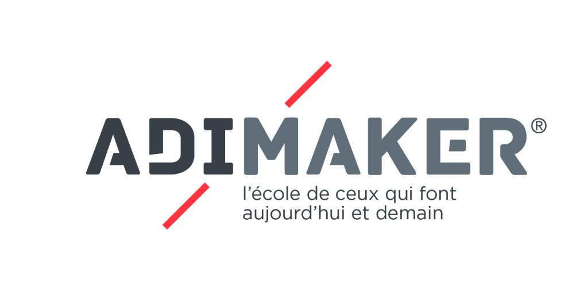

# Projet 111 arts

Cette équipe est consacrée à l'hébergement et à la centralisation du code pour le développement d'un nouveau système de vente pour l'association 111 arts.

Les technologies qui rendent ce projet possible

Je m'affiche grâce au CSS et au HTML dans votre navigateur. Python et Django me permettent de fonctionner.

Linux est mon système d'exploitation et je me souviens de tout avec MongoDB

Ce projet est un projet Adimaker

